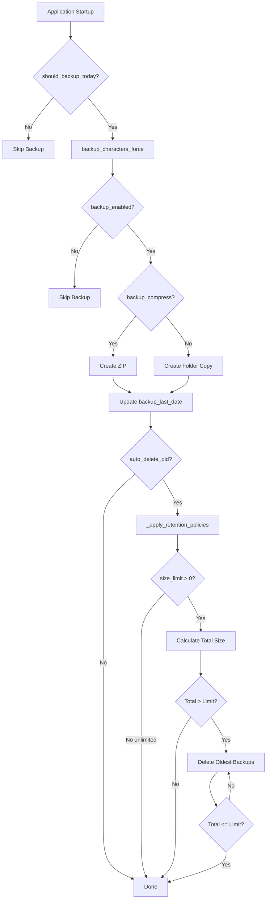

# Backup System - Technical Architecture

## Overview

This document describes the internal architecture of the backup system, including components, workflows, and implementation details.

## System Components

### 1. BackupManager (`Functions/backup_manager.py`)

**Purpose**: Core backup orchestration and retention management

**Key Methods**:

```python
# Characters Backup
def should_backup_today() -> bool
    """Check if backup needed (once per day)"""

def backup_characters_force() -> bool
    """Force backup creation (manual trigger)"""

def _create_backup() -> bool
    """Internal backup creation logic"""

def _apply_retention_policies() -> None
    """Apply size-based retention"""

# Cookies Backup
def backup_cookies_force() -> bool
    """Force cookies backup creation"""

def _perform_cookies_backup() -> dict
    """Internal cookies backup logic
    
    Note: As of v0.108, cookies are stored in AppData:
    - Path: %LOCALAPPDATA%/DAOC_Character_Manager/Eden/eden_cookies.pkl
    - Uses path_manager.get_eden_cookies_path() and get_eden_data_dir()
    - Migrated from Configuration/eden_cookies.pkl
    """

def _apply_cookies_retention_policies() -> None
    """Apply cookies retention"""
```

**Dependencies**:
- `ConfigManager` - Configuration access
- `path_manager` - Eden data paths (v0.108+)
- `logging` - Operation logging
- `shutil` - File operations (copy, move, zip)
- `datetime` - Timestamp generation
- `pathlib` - Path manipulation

---

### 2. SettingsDialog (`UI/settings_dialog.py`)

**Purpose**: User interface for backup configuration

**UI Components**:

```python
# Checkboxes
self.backup_enabled_check: QCheckBox
self.backup_compress_check: QCheckBox
self.backup_auto_delete_check: QCheckBox  # v0.108

# Input Fields
self.backup_size_limit_edit: QLineEdit
self.backup_path_edit: QLineEdit

# Labels (Statistics)
self.backup_stats_count: QLabel
self.backup_stats_last: QLabel
```

**Event Handlers**:

```python
def _on_backup_auto_delete_changed(state):
    """Handle auto-delete checkbox state change"""
    if state == 0:  # Unchecked
        show_warning()
        if user_refuses:
            recheck_checkbox()

def _on_backup_limit_changed(text):
    """Handle storage limit input change"""
    if text == "-1":
        auto_uncheck_without_warning()
```

---

### 3. ConfigManager (`Functions/config_manager.py`)

**Purpose**: Centralized configuration storage and retrieval

**Backup-Related Keys**:

```python
# Characters
"backup_enabled": bool
"backup_compress": bool
"backup_auto_delete_old": bool  # v0.108
"backup_size_limit_mb": int
"backup_path": str
"backup_last_date": str (ISO format)

# Cookies
"cookies_backup_enabled": bool
"cookies_backup_compress": bool
"cookies_backup_auto_delete_old": bool  # v0.108
"cookies_backup_size_limit_mb": int
"cookies_backup_path": str
"cookies_backup_last_date": str
```

---

### 4. MainWindow (`main.py`)

**Purpose**: Application entry point and lifecycle management

**Backup Integration Points**:

```python
def __init__():
    """On startup"""
    self.backup_manager = BackupManager(config_manager, logger)
    self._check_and_create_backups()  # Daily backup check

def _check_and_create_backups():
    """Check if backup needed today"""
    if backup_manager.should_backup_today():
        create_and_apply_retention()

def _show_settings():
    """Open settings dialog"""
    dialog = SettingsDialog(...)
    if dialog.exec_() == QDialog.Accepted:
        save_backup_settings()
```

---

## Data Flow

### Characters Backup Creation



### Cookies Backup Creation

Follows same workflow as Characters with separate configuration keys.

---

## Backup Creation Workflow

### 1. Daily Check (`should_backup_today()`)

**Logic**:
```python
def should_backup_today(self):
    if not self.config_manager.get("backup_enabled"):
        return False
    
    last_backup = self.config_manager.get("backup_last_date")
    if not last_backup:
        return True  # First backup
    
    last_date = datetime.fromisoformat(last_backup).date()
    today = datetime.now().date()
    
    return today > last_date  # Backup if different day
```

**Example Timeline**:
```
Monday 08:00    → First startup → backup_last_date = None → CREATE BACKUP
Monday 14:30    → Second startup → last_date = 2025-11-15 → SKIP (same day)
Monday 20:00    → Third startup → last_date = 2025-11-15 → SKIP (same day)
Tuesday 09:15   → First of day → last_date = 2025-11-15 → CREATE BACKUP
```

---

### 2. Backup Creation (`_create_backup()`)

**Compressed Backup (ZIP)**:
```python
def _create_backup(self):
    timestamp = datetime.now().strftime("%Y%m%d_%H%M%S")
    backup_name = f"backup_characters_{timestamp}.zip"
    backup_path = backup_dir / backup_name
    
    shutil.make_archive(
        base_name=str(backup_path.with_suffix('')),
        format='zip',
        root_dir=str(characters_dir.parent),
        base_dir=characters_dir.name
    )
    
    # Update last backup date
    self.config_manager.set("backup_last_date", datetime.now().isoformat())
```

**Uncompressed Backup (Folder)**:
```python
def _create_backup(self):
    timestamp = datetime.now().strftime("%Y%m%d_%H%M%S")
    backup_name = f"backup_characters_{timestamp}"
    backup_path = backup_dir / backup_name
    
    shutil.copytree(
        src=str(characters_dir),
        dst=str(backup_path)
    )
    
    # Update last backup date
    self.config_manager.set("backup_last_date", datetime.now().isoformat())
```

**Naming Format**:
```
backup_characters_YYYYMMDD_HHMMSS.zip     (compressed)
backup_characters_YYYYMMDD_HHMMSS/        (uncompressed)
backup_cookies_YYYYMMDD_HHMMSS.zip        (cookies)
```

---

### 3. Retention Policy (`_apply_retention_policies()`)

**Algorithm**:
```python
def _apply_retention_policies(self):
    backups = self._get_sorted_backups()  # Oldest first
    
    # Check auto-delete enabled
    auto_delete = self.config_manager.get("backup_auto_delete_old", True)
    if not auto_delete:
        log("Auto-delete disabled - skipping retention")
        return
    
    # Check size limit
    size_limit_mb = self.config_manager.get("backup_size_limit_mb", 20)
    if size_limit_mb <= 0:  # -1 or 0 = unlimited
        log("Unlimited storage - skipping retention")
        return
    
    # Calculate total size
    total_size_mb = sum(get_backup_size(b) for b in backups)
    
    # Delete oldest until under limit
    while total_size_mb > size_limit_mb and backups:
        oldest = backups.pop(0)  # Remove first (oldest)
        delete_backup(oldest)
        total_size_mb = sum(get_backup_size(b) for b in backups)
        log(f"Deleted {oldest}, new total: {total_size_mb} MB")
```

**Sorting**:
```python
def _get_sorted_backups(self):
    """Get backups sorted by modification time (oldest first)"""
    backups = []
    for item in backup_dir.iterdir():
        if item.name.startswith("backup_characters_"):
            backups.append(item)
    
    return sorted(backups, key=lambda x: x.stat().st_mtime)
```

---

## Configuration Integration

### Loading Settings

On application startup:
```python
# main.py
config = ConfigManager()
config.load()  # Read Configuration/config.json

# Default values if keys missing
backup_enabled = config.get("backup_enabled", True)
backup_compress = config.get("backup_compress", True)
backup_auto_delete_old = config.get("backup_auto_delete_old", True)
backup_size_limit_mb = config.get("backup_size_limit_mb", 20)
```

### Saving Settings

When user clicks Save in Settings Dialog:
```python
# main.py - _show_settings()
if dialog.exec_() == QDialog.Accepted:
    config.set("backup_enabled", dialog.backup_enabled_check.isChecked())
    config.set("backup_compress", dialog.backup_compress_check.isChecked())
    config.set("backup_auto_delete_old", dialog.backup_auto_delete_check.isChecked())
    
    try:
        size_limit = int(dialog.backup_size_limit_edit.text())
        config.set("backup_size_limit_mb", size_limit)
    except ValueError:
        pass  # Keep existing value
    
    config.set("backup_path", dialog.backup_path_edit.text())
    config.save()  # Write to config.json
```

---

## File Operations

### Backup Size Calculation

**ZIP File**:
```python
def get_backup_size(backup_path):
    if backup_path.is_file():
        return backup_path.stat().st_size / (1024 * 1024)  # MB
```

**Folder**:
```python
def get_backup_size(backup_path):
    if backup_path.is_dir():
        total = sum(f.stat().st_size for f in backup_path.rglob('*') if f.is_file())
        return total / (1024 * 1024)  # MB
```

### Backup Deletion

**ZIP File**:
```python
def delete_backup(backup_path):
    if backup_path.is_file():
        backup_path.unlink()  # Delete file
```

**Folder**:
```python
def delete_backup(backup_path):
    if backup_path.is_dir():
        shutil.rmtree(backup_path)  # Delete folder recursively
```

---

## Logging

### Log Levels

**INFO**: Normal operations
```python
log_with_action(logger, "info", "Creating backup", action="BACKUP")
log_with_action(logger, "info", "Backup created successfully", action="BACKUP")
```

**DEBUG**: Detailed flow
```python
log_with_action(logger, "debug", f"Found {len(backups)} existing backups", action="RETENTION")
log_with_action(logger, "debug", "Auto-delete disabled - skipping retention", action="RETENTION")
```

**WARNING**: Issues
```python
log_with_action(logger, "warning", "Backup directory not found", action="BACKUP")
log_with_action(logger, "warning", f"Total size {total_mb} MB exceeds limit {limit_mb} MB", action="RETENTION")
```

**ERROR**: Failures
```python
log_with_action(logger, "error", f"Failed to create backup: {e}", action="BACKUP")
```

### Log Examples

```
2025-11-15 08:00:12 | INFO    | BACKUP    | Creating character backup
2025-11-15 08:00:14 | INFO    | BACKUP    | Backup created: backup_characters_20251115_080012.zip (1.2 MB)
2025-11-15 08:00:14 | DEBUG   | RETENTION | Found 8 existing backups
2025-11-15 08:00:14 | DEBUG   | RETENTION | Total size: 22.4 MB, Limit: 20.0 MB
2025-11-15 08:00:14 | INFO    | RETENTION | Deleted backup_characters_20251101_083022.zip
2025-11-15 08:00:14 | INFO    | RETENTION | New total size: 19.8 MB (under limit)
```

---

## UI Event Flow

### Auto-Delete Warning Dialog

**Trigger**: User manually unchecks "Auto-delete old backups"

**Flow**:
```
User clicks checkbox → stateChanged(0) → _on_backup_auto_delete_changed(0)
    ↓
Check state == 0 (unchecked)
    ↓
Show QMessageBox.warning() with risks
    ↓
User clicks [No] → Recheck checkbox (blockSignals to prevent loop)
    ↓
User clicks [Yes] → Keep unchecked, save setting
```

**Implementation**:
```python
def _on_backup_auto_delete_changed(self, state):
    if state == 0:  # IMPORTANT: Integer, not Qt.Unchecked
        reply = QMessageBox.warning(
            self,
            lang.get("backup_auto_delete_warning_title"),
            lang.get("backup_auto_delete_warning_message"),
            QMessageBox.Yes | QMessageBox.No,
            QMessageBox.No  # Default button
        )
        
        if reply == QMessageBox.No:
            # Cancel uncheck
            self.backup_auto_delete_check.blockSignals(True)
            self.backup_auto_delete_check.setChecked(True)
            self.backup_auto_delete_check.blockSignals(False)
```

**Critical Note**: PySide6 returns checkbox state as integer (0=unchecked, 2=checked), not Qt enum.

---

### Auto-Uncheck on -1

**Trigger**: User types `-1` in storage limit field

**Flow**:
```
User types "-1" → textChanged("-1") → _on_backup_limit_changed("-1")
    ↓
Parse as integer
    ↓
Check if value == -1
    ↓
Uncheck auto-delete checkbox (blockSignals to prevent warning)
    ↓
No dialog shown (intentional)
```

**Implementation**:
```python
def _on_backup_limit_changed(self, text):
    try:
        limit = int(text)
        if limit == -1:
            # Silent uncheck (unlimited = no deletion needed)
            self.backup_auto_delete_check.blockSignals(True)
            self.backup_auto_delete_check.setChecked(False)
            self.backup_auto_delete_check.blockSignals(False)
    except ValueError:
        pass  # Invalid input, ignore
```

**Rationale**: Unlimited storage (-1) makes auto-delete meaningless, so automatically disable it without annoying the user.

---

## Testing Infrastructure

### Test Script (`Tools/test_backup_system.py`)

**Purpose**: Automated testing of all backup functionality

**Test Suites**:

1. **test_daily_backup()**
   - First startup (no last_date) → should create
   - Same day startup → should skip
   - Next day startup → should create

2. **test_compression()**
   - Create ZIP backup → verify size
   - Create folder backup → verify size

3. **test_auto_delete_retention()**
   - Enabled: Create 5 backups, 1MB limit → verify deletion
   - Disabled: Create 5 backups, 1MB limit → verify all kept

4. **test_storage_limits()**
   - 2MB limit: Create 10 backups → verify under limit
   - -1 unlimited: Create 15 backups → verify all kept

5. **test_cookies_backup()**
   - Create cookies backup → verify creation
   - Apply retention → verify policy respected

**Isolation**:
- Uses `Test_Backup_System/` directory
- Creates test config with isolated paths
- Restores original config after tests
- Auto-cleanup on completion

**Execution**:
```powershell
.venv\Scripts\python.exe Tools/test_backup_system.py
```

**Output**:
```
═══════════════════════════════════════════════════
     Tests du Système de Backup - v0.108
═══════════════════════════════════════════════════

► Test 1: Backup quotidien......................... ✓ RÉUSSI
► Test 2: Compression.............................. ✓ RÉUSSI
► Test 3: Auto-delete.............................. ✓ RÉUSSI
► Test 4: Limites stockage......................... ✓ RÉUSSI
► Test 5: Cookies backup........................... ✓ RÉUSSI

Résultat final: 5/5 tests réussis
✓ TOUS LES TESTS SONT RÉUSSIS !
```

---

## Error Handling

### Backup Creation Failures

**Possible Causes**:
- Source directory doesn't exist
- Insufficient disk space
- Permission denied on backup folder
- Corrupted source files

**Handling**:
```python
try:
    create_backup()
    log("Backup created successfully")
    return True
except OSError as e:
    log(f"Failed to create backup: {e}", level="error")
    return False
except Exception as e:
    log(f"Unexpected error: {e}", level="error")
    return False
```

### Retention Policy Failures

**Possible Causes**:
- Cannot delete old backup (file locked)
- Cannot calculate backup size (corrupted ZIP)
- Infinite loop (all backups undeletable)

**Handling**:
```python
def _apply_retention_policies(self):
    try:
        backups = self._get_sorted_backups()
        # ... deletion logic
    except Exception as e:
        log(f"Retention policy failed: {e}", level="error")
        # Don't crash, just skip retention
```

---

## Performance Considerations

### Backup Creation Time

**Factors**:
- Number of character files
- Total data size
- Compression enabled/disabled
- Disk I/O speed

**Typical Times**:
| Characters | Uncompressed | Compressed (ZIP) |
|-----------|--------------|------------------|
| 5 | 0.5s | 1.5s |
| 10 | 1s | 3s |
| 20 | 2s | 6s |
| 50 | 5s | 15s |

**Optimization**: Compression adds time but saves 60-70% disk space.

### Retention Calculation Time

**Factors**:
- Number of backups
- Backup format (ZIP vs folder)

**Typical Times**:
| Backups | ZIP Size Calc | Folder Size Calc |
|---------|---------------|------------------|
| 10 | <0.1s | 0.5s |
| 50 | 0.2s | 2s |
| 100 | 0.5s | 5s |

**Optimization**: ZIP files faster to calculate (single file stat vs recursive directory walk).

---

## Security Considerations

### Backup Content

**What's Backed Up**:
- Character JSON files (plain text)
- Cookies files (browser cookies)

**Cookie Storage Location (v0.108+)**:
- **New Path**: `%LOCALAPPDATA%/DAOC_Character_Manager/Eden/eden_cookies.pkl`
- **Old Path**: `Configuration/eden_cookies.pkl` (migrated automatically)
- **Reason**: PyInstaller --onefile compatibility
- **Migration**: Automatic on first startup, backup created as `.pkl.migrated`

**Not Encrypted**:
- Backups stored as plain ZIP or folder copies
- No password protection on ZIP files

**Recommendation**: If storing sensitive data, use OS-level encryption (BitLocker, VeraCrypt).

### Path Traversal

**Protection**:
```python
# Validate backup path stays within expected boundaries
if not backup_path.resolve().is_relative_to(app_folder):
    raise SecurityError("Invalid backup path")
```

### File Permissions

**Windows**:
- Inherits folder permissions
- No special ACLs set

**Recommendation**: Backup folder should not be world-readable if on shared system.

---

## Version History

### v0.108 (Current)

**New Features**:
- Auto-delete old backups checkbox
- Cookies backup storage limit
- Warning dialog on auto-delete disable
- Auto-uncheck when -1 unlimited entered
- **Chrome Profile Management**: Dedicated Chrome profile for Selenium in AppData
- **Cookie Migration**: Automatic migration from `Configuration/` to `Eden/` in AppData
- **Cookie Path Update**: Backup system now uses `path_manager.get_eden_cookies_path()`

**Changed**:
- Statistics reorganized with vertical separators
- Cookies default limit: 10 MB → 20 MB
- Checkbox layout: moved auto-delete to top section
- **Cookies Location**: Moved from `Configuration/eden_cookies.pkl` to `%LOCALAPPDATA%/DAOC_Character_Manager/Eden/eden_cookies.pkl`

**Fixed**:
- Warning dialog state comparison (Qt enum → integer)

---

## Related Documentation

- [User Guide](BACKUP_USER_GUIDE.md) - How to use backups
- [Settings Reference](BACKUP_SETTINGS.md) - All settings explained
- [Retention Policy](BACKUP_RETENTION_POLICY.md) - Deletion algorithm
- [README](README.md) - Main documentation index
