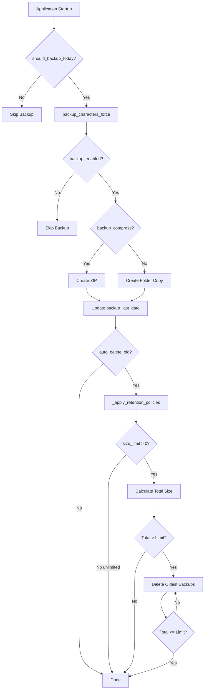

# 🔄 Backup System - Technical Documentation

**Version**: 2.1  
**Date**: November 2025  
**Last Updated**: November 25, 2025  
**Component**: `Functions/backup_manager.py`  
**Related**: `UI/settings_dialog.py`, `Functions/config_manager.py`, `Functions/path_manager.py`, `main.py`  
**Branch**: 108_Imp_Armo

---

## 📋 Table of Contents

1. [Overview](#overview)
2. [System Architecture](#system-architecture)
3. [Backup Creation Workflow](#backup-creation-workflow)
4. [Retention Policy](#retention-policy)
5. [Configuration Settings](#configuration-settings)
6. [User Guide](#user-guide)
7. [Smart Folder Creation](#smart-folder-creation)
8. [Testing Infrastructure](#testing-infrastructure)
9. [Error Handling](#error-handling)
10. [Performance Considerations](#performance-considerations)
11. [Security Considerations](#security-considerations)

---

## Overview

The Automatic Backup System protects character data, Eden cookies, and armor configurations from accidental loss through daily automated backups with intelligent space management.

### System Components

The system consists of three main subsystems:

1. **Backup Manager** - Core orchestration and retention management
2. **Settings UI** - User interface for configuration
3. **Configuration Manager** - Centralized settings storage

### Key Features

- ✅ **Daily automatic backup** on first startup
- ✅ **Smart compression** (ZIP format optional)
- ✅ **Automatic retention** with configurable limits
- ✅ **Separate backups** for characters, cookies, and armor
- ✅ **Smart folder creation** (v2.1+) - folders only created when needed
- ✅ **Manual management** via Settings dialog
- ✅ **Full translations** (FR/EN/DE)

---

## System Architecture

### Core Components

#### 1. BackupManager (`Functions/backup_manager.py`)

**Purpose**: Core backup orchestration and retention management

**Key Methods**:

```python
# Characters Backup
def should_backup_today() -> bool
    """Check if backup needed (once per day)"""

def backup_characters_force() -> bool
    """Force backup creation (manual trigger)"""

def _create_backup() -> bool
    """Internal backup creation logic"""

def _apply_retention_policies() -> None
    """Apply size-based retention"""

# Cookies Backup
def backup_cookies_force() -> bool
    """Force cookies backup creation"""

def _perform_cookies_backup() -> dict
    """Internal cookies backup logic
    
    Note: As of v0.108+, cookies backup strategy changed:
    - Backups ONLY: eden_cookies.pkl file (~10-50 KB)
    - Excludes: ChromeProfile/ folder (can be regenerated)
    - Path: %LOCALAPPDATA%/DAOC_Character_Manager/Eden/eden_cookies.pkl
    - Uses path_manager.get_eden_cookies_path()
    - Migrated from Configuration/eden_cookies.pkl
    - Reason: Reduce backup size from 50+ MB to ~10 KB
    """

def _apply_cookies_retention_policies() -> None
    """Apply cookies retention"""
```

**Dependencies**:
- `ConfigManager` - Configuration access
- `path_manager` - Eden data paths (v0.108+)
- `logging` - Operation logging
- `shutil` - File operations (copy, move, zip)
- `datetime` - Timestamp generation
- `pathlib` - Path manipulation

---

#### 2. SettingsDialog (`UI/settings_dialog.py`)

**Purpose**: User interface for backup configuration

**UI Components**:

```python
# Checkboxes
self.backup_enabled_check: QCheckBox
self.backup_compress_check: QCheckBox
self.backup_auto_delete_check: QCheckBox  # v0.108

# Input Fields
self.backup_size_limit_edit: QLineEdit
self.backup_path_edit: QLineEdit

# Labels (Statistics)
self.backup_stats_count: QLabel
self.backup_stats_last: QLabel
```

**Event Handlers**:

```python
def _on_backup_auto_delete_changed(state):
    """Handle auto-delete checkbox state change"""
    if state == 0:  # Unchecked
        show_warning()
        if user_refuses:
            recheck_checkbox()

def _on_backup_limit_changed(text):
    """Handle storage limit input change"""
    if text == "-1":
        auto_uncheck_without_warning()
```

---

#### 3. ConfigManager (`Functions/config_manager.py`)

**Purpose**: Centralized configuration storage and retrieval

**Backup-Related Keys**:

```python
# Characters
"backup_enabled": bool
"backup_compress": bool
"backup_auto_delete_old": bool  # v0.108
"backup_size_limit_mb": int
"backup_path": str
"backup_last_date": str (ISO format)

# Cookies
"cookies_backup_enabled": bool
"cookies_backup_compress": bool
"cookies_backup_auto_delete_old": bool  # v0.108
"cookies_backup_size_limit_mb": int
"cookies_backup_path": str
"cookies_backup_last_date": str
```

---

#### 4. MainWindow (`main.py`)

**Purpose**: Application entry point and lifecycle management

**Backup Integration Points**:

```python
def __init__():
    """On startup"""
    self.backup_manager = BackupManager(config_manager, logger)
    self._check_and_create_backups()  # Daily backup check

def _check_and_create_backups():
    """Check if backup needed today"""
    if backup_manager.should_backup_today():
        create_and_apply_retention()

def _show_settings():
    """Open settings dialog"""
    dialog = SettingsDialog(...)
    if dialog.exec_() == QDialog.Accepted:
        save_backup_settings()
```

---

### Data Flow

#### Characters Backup Creation



---

## Backup Creation Workflow

### 1. Daily Check (`should_backup_today()`)

**Logic**:
```python
def should_backup_today(self):
    if not self.config_manager.get("backup_enabled"):
        return False
    
    last_backup = self.config_manager.get("backup_last_date")
    if not last_backup:
        return True  # First backup
    
    last_date = datetime.fromisoformat(last_backup).date()
    today = datetime.now().date()
    
    return today > last_date  # Backup if different day
```

**Example Timeline**:
```
Monday 08:00    → First startup → backup_last_date = None → CREATE BACKUP
Monday 14:30    → Second startup → last_date = 2025-11-15 → SKIP (same day)
Monday 20:00    → Third startup → last_date = 2025-11-15 → SKIP (same day)
Tuesday 09:15   → First of day → last_date = 2025-11-15 → CREATE BACKUP
```

---

### 2. Backup Creation (`_create_backup()`)

**Compressed Backup (ZIP)**:
```python
def _create_backup(self):
    timestamp = datetime.now().strftime("%Y%m%d_%H%M%S")
    backup_name = f"backup_characters_{timestamp}.zip"
    backup_path = backup_dir / backup_name
    
    shutil.make_archive(
        base_name=str(backup_path.with_suffix('')),
        format='zip',
        root_dir=str(characters_dir.parent),
        base_dir=characters_dir.name
    )
    
    # Update last backup date
    self.config_manager.set("backup_last_date", datetime.now().isoformat())
```

**Uncompressed Backup (Folder)**:
```python
def _create_backup(self):
    timestamp = datetime.now().strftime("%Y%m%d_%H%M%S")
    backup_name = f"backup_characters_{timestamp}"
    backup_path = backup_dir / backup_name
    
    shutil.copytree(
        src=str(characters_dir),
        dst=str(backup_path)
    )
    
    # Update last backup date
    self.config_manager.set("backup_last_date", datetime.now().isoformat())
```

**Naming Format**:
```
backup_characters_YYYYMMDD_HHMMSS.zip     (compressed)
backup_characters_YYYYMMDD_HHMMSS/        (uncompressed)
backup_cookies_YYYYMMDD_HHMMSS.zip        (cookies)
backup_armor_YYYYMMDD_HHMMSS.zip          (armor)
```

---

### 3. Retention Policy (`_apply_retention_policies()`)

**Algorithm**:
```python
def _apply_retention_policies(self):
    backups = self._get_sorted_backups()  # Oldest first
    
    # Check auto-delete enabled
    auto_delete = self.config_manager.get("backup_auto_delete_old", True)
    if not auto_delete:
        log("Auto-delete disabled - skipping retention")
        return
    
    # Check size limit
    size_limit_mb = self.config_manager.get("backup_size_limit_mb", 20)
    if size_limit_mb <= 0:  # -1 or 0 = unlimited
        log("Unlimited storage - skipping retention")
        return
    
    # Calculate total size
    total_size_mb = sum(get_backup_size(b) for b in backups)
    
    # Delete oldest until under limit
    while total_size_mb > size_limit_mb and backups:
        oldest = backups.pop(0)  # Remove first (oldest)
        delete_backup(oldest)
        total_size_mb = sum(get_backup_size(b) for b in backups)
        log(f"Deleted {oldest}, new total: {total_size_mb} MB")
```

**Sorting**:
```python
def _get_sorted_backups(self):
    """Get backups sorted by modification time (oldest first)"""
    backups = []
    for item in backup_dir.iterdir():
        if item.name.startswith("backup_characters_"):
            backups.append(item)
    
    return sorted(backups, key=lambda x: x.stat().st_mtime)
```

---

## Retention Policy

### Core Concepts

**Definition**: Automatic deletion of old backups when storage limits are reached.

**Purpose**:
- Prevent unlimited disk space consumption
- Maintain configurable number of recent backups
- Balance between backup history and storage cost

**Trigger**: Runs after each backup creation

---

### Detailed Implementation

#### Step 1: Check Auto-Delete Enabled

**Code**:
```python
def _apply_retention_policies(self):
    auto_delete = self.config_manager.get("backup_auto_delete_old", True)
    if not auto_delete:
        log("Auto-delete disabled - skipping retention policy")
        return
```

**Logic**:
- If `backup_auto_delete_old` = `False` → **SKIP ALL RETENTION**
- User explicitly disabled auto-delete → honor their choice
- All backups kept regardless of size

---

#### Step 2: Check Storage Limit

**Code**:
```python
size_limit_mb = self.config_manager.get("backup_size_limit_mb", 20)
if size_limit_mb <= 0:
    log("Unlimited storage mode (-1) - skipping retention")
    return
```

**Logic**:
| Limit Value | Behavior |
|-------------|----------|
| `-1` | Unlimited - skip retention |
| `0` | Unlimited - skip retention |
| `1-999` | Apply retention with limit |

---

#### Step 3: Get Sorted Backups

**Code**:
```python
def _get_sorted_backups(self):
    """Get backups sorted by modification time (oldest first)."""
    backups = []
    backup_dir = self._get_backup_dir()
    
    for item in backup_dir.iterdir():
        if item.name.startswith("backup_characters_"):
            backups.append(item)
    
    # Sort by modification time (oldest first)
    return sorted(backups, key=lambda x: x.stat().st_mtime)
```

**Sorting Criteria**:
- Uses file modification time (`st_mtime`)
- **Oldest first** (important for deletion order)
- Includes both ZIP files and folders

---

#### Step 4: Calculate Total Size

**Code**:
```python
def _get_backup_size(self, backup_path):
    """Calculate backup size in MB."""
    if backup_path.is_file():
        # ZIP file
        return backup_path.stat().st_size / (1024 * 1024)
    elif backup_path.is_dir():
        # Folder
        total = sum(
            f.stat().st_size 
            for f in backup_path.rglob('*') 
            if f.is_file()
        )
        return total / (1024 * 1024)
    return 0

total_size_mb = sum(self._get_backup_size(b) for b in backups)
```

**Size Calculation**:
- **ZIP files**: Single file size (fast)
- **Folders**: Recursive sum of all files (slower)
- **Unit**: Megabytes (MB) with decimal precision

---

#### Step 5: Delete Oldest Until Under Limit

**Code**:
```python
while total_size_mb > size_limit_mb and backups:
    oldest_backup = backups.pop(0)  # Remove first (oldest)
    
    backup_size_mb = self._get_backup_size(oldest_backup)
    
    # Delete backup
    if oldest_backup.is_file():
        oldest_backup.unlink()  # Delete file
    elif oldest_backup.is_dir():
        shutil.rmtree(oldest_backup)  # Delete folder
    
    log(f"Deleted old backup: {oldest_backup.name} ({backup_size_mb:.2f} MB)")
    
    # Recalculate total
    total_size_mb = sum(self._get_backup_size(b) for b in backups)
```

**Deletion Logic**:
1. Check if total > limit
2. If yes, remove oldest from list (index 0)
3. Delete from filesystem
4. Recalculate total size
5. Repeat until total ≤ limit

---

### Retention Policy Modes

#### Mode 1: Full Protection (Default)

**Settings**:
```json
{
  "backup_auto_delete_old": true,
  "backup_size_limit_mb": 20
}
```

**Behavior**:
- Automatic deletion enabled
- Size limit: 20 MB
- Deletes oldest when limit exceeded

**Best For**:
- Normal users
- Limited disk space
- Automatic management

---

#### Mode 2: Unlimited Backups

**Settings**:
```json
{
  "backup_auto_delete_old": false,
  "backup_size_limit_mb": 20
}
```

**Behavior**:
- Auto-delete disabled (takes priority)
- Size limit ignored
- Keeps all backups forever

**Best For**:
- Archive purposes
- Testing/development
- Ample disk space

**Risks**:
- Disk saturation
- Backup failures (no space)
- Manual cleanup required

---

#### Mode 3: High Limit

**Settings**:
```json
{
  "backup_auto_delete_old": true,
  "backup_size_limit_mb": 100
}
```

**Behavior**:
- Automatic deletion enabled
- Size limit: 100 MB
- Allows more backup history

**Best For**:
- Users with many characters
- Long backup history needed
- Good disk space available

---

#### Mode 4: Aggressive Cleanup

**Settings**:
```json
{
  "backup_auto_delete_old": true,
  "backup_size_limit_mb": 5
}
```

**Behavior**:
- Automatic deletion enabled
- Size limit: 5 MB
- Keeps only recent backups

**Best For**:
- Very limited disk space
- Only need last 2-3 backups
- Frequent external backups

---

## Configuration Settings

### Loading Settings

On application startup:
```python
# main.py
config = ConfigManager()
config.load()  # Read Configuration/config.json

# Default values if keys missing
backup_enabled = config.get("backup_enabled", True)
backup_compress = config.get("backup_compress", True)
backup_auto_delete_old = config.get("backup_auto_delete_old", True)
backup_size_limit_mb = config.get("backup_size_limit_mb", 20)
```

---

### Saving Settings

When user clicks Save in Settings Dialog:
```python
# main.py - _show_settings()
if dialog.exec_() == QDialog.Accepted:
    config.set("backup_enabled", dialog.backup_enabled_check.isChecked())
    config.set("backup_compress", dialog.backup_compress_check.isChecked())
    config.set("backup_auto_delete_old", dialog.backup_auto_delete_check.isChecked())
    
    try:
        size_limit = int(dialog.backup_size_limit_edit.text())
        config.set("backup_size_limit_mb", size_limit)
    except ValueError:
        pass  # Keep existing value
    
    config.set("backup_path", dialog.backup_path_edit.text())
    config.save()  # Write to config.json
```

---

### Settings Reference

#### Characters Backup Settings

**Enable Backups**:
- **Control**: Checkbox
- **Default**: `True`
- **Config Key**: `backup_enabled`

**Compress Backups**:
- **Control**: Checkbox
- **Default**: `True`
- **Config Key**: `backup_compress`
- **Effect**: ZIP format vs folder copy

**Auto-Delete Old Backups**:
- **Control**: Checkbox
- **Default**: `True`
- **Config Key**: `backup_auto_delete_old`
- **Warning**: Shows dialog when unchecking

**Storage Limit**:
- **Control**: Text input
- **Default**: `20` MB
- **Range**: `-1` or `1-999`
- **Config Key**: `backup_size_limit_mb`
- **Special**: `-1` = unlimited

**Backup Path**:
- **Control**: Text field + buttons
- **Default**: `<app_folder>/Backups/Characters/`
- **Config Key**: `backup_path`

---

#### Cookies Backup Settings

All settings mirror Characters with separate configuration:

- **Config Key**: `cookies_backup_enabled`
- **Config Key**: `cookies_backup_compress`
- **Config Key**: `cookies_backup_auto_delete_old`
- **Config Key**: `cookies_backup_size_limit_mb` (default: 20 MB)
- **Config Key**: `cookies_backup_path`

**Backup Content**:
- ✅ **Included**: `eden_cookies.pkl` (cookies file only)
- ❌ **Excluded**: ChromeProfile folder (not backed up)
- **Reason**: Chrome profile can be regenerated, cookies cannot

---

### UI Event Handling

#### Auto-Delete Checkbox

**Event**: `stateChanged`

**Logic**:
```python
def _on_backup_auto_delete_changed(self, state):
    if state == 0:  # Unchecked
        reply = QMessageBox.warning(
            self,
            lang.get("backup_auto_delete_warning_title"),
            lang.get("backup_auto_delete_warning_message"),
            QMessageBox.Yes | QMessageBox.No,
            QMessageBox.No
        )
        
        if reply == QMessageBox.No:
            # Cancel uncheck
            self.backup_auto_delete_check.blockSignals(True)
            self.backup_auto_delete_check.setChecked(True)
            self.backup_auto_delete_check.blockSignals(False)
```

**Critical Note**: PySide6 returns checkbox state as integer (0=unchecked, 2=checked), not Qt enum.

---

#### Storage Limit Field

**Event**: `textChanged`

**Logic**:
```python
def _on_backup_limit_changed(self, text):
    try:
        limit = int(text)
        if limit == -1:
            # Silent uncheck (unlimited = no deletion needed)
            self.backup_auto_delete_check.blockSignals(True)
            self.backup_auto_delete_check.setChecked(False)
            self.backup_auto_delete_check.blockSignals(False)
    except ValueError:
        pass  # Invalid input, ignore
```

**Rationale**: Unlimited storage (-1) makes auto-delete meaningless, so automatically disable it without annoying the user.

---

## User Guide

### What is Backed Up?

**Characters Backup**:
- All character files in Characters folder
- Configuration files associated with characters
- Timestamps preserved for restoration

**Cookies Backup**:
- Eden session cookies for automatic login
- Browser credentials for Herald import
- Separate backup from characters

**Armor Backup** (v2.1):
- Armor resistance data (armor_resists.json)
- Custom armor configurations
- Separate backup from characters

---

### How It Works

#### Automatic Daily Backup

The system creates backups **automatically** on the first application startup of each day:

1. **Application starts**
2. **System checks** last backup date
3. **If new day** → Creates backup automatically
4. **If same day** → Skips (already backed up)

**Example**:
```
Monday 08:00   → Backup created ✓
Monday 14:30   → Skipped (already done today)
Monday 20:00   → Skipped (already done today)
Tuesday 09:15  → New backup created ✓
```

---

### Backup Naming

Backups use a standardized naming format:
```
backup_characters_YYYYMMDD_HHMMSS.zip
backup_cookies_YYYYMMDD_HHMMSS.zip
backup_armor_YYYYMMDD_HHMMSS.zip
```

**Example**:
- `backup_characters_20251115_143022.zip`
  - Date: 2025-11-15
  - Time: 14:30:22

---

### Accessing Settings

1. Click **Configuration** menu
2. Select **Settings**
3. Go to **Backups** tab

---

### Recommended Settings

For most users:
```
☑ Enable backups
☑ Compress backups (ZIP)
☑ Auto-delete old backups
Storage limit: 20-50 MB
```

---

### Restoring a Backup

#### Full Restoration

1. **Locate backup file** (click 📂 Open Folder)
2. **Close application**
3. **Extract ZIP** to temporary folder (if compressed)
4. **Replace** entire Characters folder with backup content
5. **Restart application**

#### Selective Restoration

1. **Open backup** (extract if ZIP)
2. **Find specific character** file (e.g., `MyChar_Albion.json`)
3. **Copy** to Characters folder
4. **Restart application**

**⚠️ Important**: Always close the application before modifying character files.

---

## Smart Folder Creation

### Overview (v2.1)

**NEW BEHAVIOR**: Backup folders are **NOT created on startup** anymore.

**Old Behavior** (v0.108 and earlier):
```
Application Launch
    ↓
Backup/Characters/ folder created (even if empty)
Backup/Cookies/ folder created (even if empty)
Backup/Armor/ folder created (even if empty)
    ↓
Result: Empty folders cluttering your directory
```

**New Behavior** (v2.1+):
```
Application Launch
    ↓
NO folders created
    ↓
First Backup Execution
    ↓
Check if source exists (Characters/, eden_cookies.pkl, armor_resists.json)
    ├─ Source exists: Create backup folder + perform backup
    └─ Source missing: Skip (no folder created)
```

---

### Benefits

- ✅ No empty folders on first launch
- ✅ Cleaner directory structure
- ✅ Folders appear only when actually used
- ✅ Automatic cleanup when moving backups

---

### Example Timeline

```
Day 1, 08:00 - Fresh Install
    → No backup folders exist yet

Day 1, 10:00 - Add first character
    → Characters/ folder created with character data
    
Day 2, 08:00 - Application startup
    → Characters/ exists → Backup/Characters/ created
    → Backup performed: backup_characters_20251102_080000.zip
    
Day 2, 09:00 - Configure cookies
    → eden_cookies.pkl created
    
Day 3, 08:00 - Application startup
    → Characters/ exists → Backup/Characters/ already exists
    → eden_cookies.pkl exists → Backup/Cookies/ created
    → Two backups performed
```

---

## Testing Infrastructure

### Test Script (`Tools/test_backup_system.py`)

**Purpose**: Automated testing of all backup functionality

**Test Suites**:

1. **test_daily_backup()**
   - First startup (no last_date) → should create
   - Same day startup → should skip
   - Next day startup → should create

2. **test_compression()**
   - Create ZIP backup → verify size
   - Create folder backup → verify size

3. **test_auto_delete_retention()**
   - Enabled: Create 5 backups, 1MB limit → verify deletion
   - Disabled: Create 5 backups, 1MB limit → verify all kept

4. **test_storage_limits()**
   - 2MB limit: Create 10 backups → verify under limit
   - -1 unlimited: Create 15 backups → verify all kept

5. **test_cookies_backup()**
   - Create cookies backup → verify creation
   - Apply retention → verify policy respected

**Isolation**:
- Uses `Test_Backup_System/` directory
- Creates test config with isolated paths
- Restores original config after tests
- Auto-cleanup on completion

**Execution**:
```powershell
.venv\Scripts\python.exe Tools/test_backup_system.py
```

**Output**:
```
═══════════════════════════════════════════════════
     Tests du Système de Backup - v0.108
═══════════════════════════════════════════════════

► Test 1: Backup quotidien......................... ✓ RÉUSSI
► Test 2: Compression.............................. ✓ RÉUSSI
► Test 3: Auto-delete.............................. ✓ RÉUSSI
► Test 4: Limites stockage......................... ✓ RÉUSSI
► Test 5: Cookies backup........................... ✓ RÉUSSI

Résultat final: 5/5 tests réussis
✓ TOUS LES TESTS SONT RÉUSSIS !
```

---

## Error Handling

### Backup Creation Failures

**Possible Causes**:
- Source directory doesn't exist
- Insufficient disk space
- Permission denied on backup folder
- Corrupted source files

**Handling**:
```python
try:
    create_backup()
    log("Backup created successfully")
    return True
except OSError as e:
    log(f"Failed to create backup: {e}", level="error")
    return False
except Exception as e:
    log(f"Unexpected error: {e}", level="error")
    return False
```

---

### Retention Policy Failures

**Possible Causes**:
- Cannot delete old backup (file locked)
- Cannot calculate backup size (corrupted ZIP)
- Infinite loop (all backups undeletable)

**Handling**:
```python
def _apply_retention_policies(self):
    try:
        backups = self._get_sorted_backups()
        # ... deletion logic
    except Exception as e:
        log(f"Retention policy failed: {e}", level="error")
        # Don't crash, just skip retention
```

---

## Performance Considerations

### Backup Creation Time

**Factors**:
- Number of character files
- Total data size
- Compression enabled/disabled
- Disk I/O speed

**Typical Times**:
| Characters | Uncompressed | Compressed (ZIP) |
|-----------|--------------|------------------|
| 5 | 0.5s | 1.5s |
| 10 | 1s | 3s |
| 20 | 2s | 6s |
| 50 | 5s | 15s |

**Optimization**: Compression adds time but saves 60-70% disk space.

---

### Retention Calculation Time

**Factors**:
- Number of backups
- Backup format (ZIP vs folder)

**Typical Times**:
| Backups | ZIP Size Calc | Folder Size Calc |
|---------|---------------|------------------|
| 10 | <0.1s | 0.5s |
| 50 | 0.2s | 2s |
| 100 | 0.5s | 5s |

**Optimization**: ZIP files faster to calculate (single file stat vs recursive directory walk).

---

## Security Considerations

### Backup Content

**What's Backed Up**:
- Character JSON files (plain text)
- Cookies files (browser cookies)

**Cookie Storage Location (v0.108+)**:
- **New Path**: `%LOCALAPPDATA%/DAOC_Character_Manager/Eden/eden_cookies.pkl`
- **Old Path**: `Configuration/eden_cookies.pkl` (migrated automatically)
- **Reason**: PyInstaller --onefile compatibility
- **Migration**: Automatic on first startup, backup created as `.pkl.migrated`

**Not Encrypted**:
- Backups stored as plain ZIP or folder copies
- No password protection on ZIP files

**Recommendation**: If storing sensitive data, use OS-level encryption (BitLocker, VeraCrypt).

---

### Path Traversal

**Protection**:
```python
# Validate backup path stays within expected boundaries
if not backup_path.resolve().is_relative_to(app_folder):
    raise SecurityError("Invalid backup path")
```

---

### File Permissions

**Windows**:
- Inherits folder permissions
- No special ACLs set

**Recommendation**: Backup folder should not be world-readable if on shared system.

---

## Logging

### Log Levels

**INFO**: Normal operations
```python
log_with_action(logger, "info", "Creating backup", action="BACKUP")
log_with_action(logger, "info", "Backup created successfully", action="BACKUP")
```

**DEBUG**: Detailed flow
```python
log_with_action(logger, "debug", f"Found {len(backups)} existing backups", action="RETENTION")
log_with_action(logger, "debug", "Auto-delete disabled - skipping retention", action="RETENTION")
```

**WARNING**: Issues
```python
log_with_action(logger, "warning", "Backup directory not found", action="BACKUP")
log_with_action(logger, "warning", f"Total size {total_mb} MB exceeds limit {limit_mb} MB", action="RETENTION")
```

**ERROR**: Failures
```python
log_with_action(logger, "error", f"Failed to create backup: {e}", action="BACKUP")
```

---

### Log Examples

```
2025-11-15 08:00:12 | INFO    | BACKUP    | Creating character backup
2025-11-15 08:00:14 | INFO    | BACKUP    | Backup created: backup_characters_20251115_080012.zip (1.2 MB)
2025-11-15 08:00:14 | DEBUG   | RETENTION | Found 8 existing backups
2025-11-15 08:00:14 | DEBUG   | RETENTION | Total size: 22.4 MB, Limit: 20.0 MB
2025-11-15 08:00:14 | INFO    | RETENTION | Deleted backup_characters_20251101_083022.zip
2025-11-15 08:00:14 | INFO    | RETENTION | New total size: 19.8 MB (under limit)
```

---

## Version History

### v2.1 (Current)

**New Features**:
- Smart folder creation (folders only created when needed)
- Armor backup support
- Improved logging
- Documentation consolidation

**Changed**:
- Backup folder creation strategy
- Documentation structure

---

### v0.108

**New Features**:
- Auto-delete old backups checkbox
- Cookies backup storage limit
- Warning dialog on auto-delete disable
- Auto-uncheck when -1 unlimited entered
- Chrome Profile Management
- Cookie Migration
- Cookie Backup Strategy (cookies file only)
- Clean Eden Button

**Changed**:
- Statistics reorganized with vertical separators
- Cookies default limit: 10 MB → 20 MB
- Checkbox layout: moved auto-delete to top section
- Cookies Location: Moved to AppData
- Cookies Backup Content: Eden folder → cookies file only

**Fixed**:
- Warning dialog state comparison (Qt enum → integer)
- Cookies backup disappearing after creation

---

## FAQ

### Q: Can I disable backups completely?
**A**: Yes, uncheck "Enable backups" in Settings. Not recommended.

### Q: How much space do backups use?
**A**: Depends on character count and compression:
- 5 characters, ZIP: ~500 KB per backup
- 10 characters, ZIP: ~1 MB per backup
- Without ZIP: 2-3x larger

### Q: What happens if I delete a backup file?
**A**: Nothing immediately. You just lose that restore point. Application continues normally.

### Q: Can I have multiple backup locations?
**A**: No, only one active location. But you can manually copy backups elsewhere.

### Q: Does backup slow down startup?
**A**: Minimal impact. Backup runs in background, usually completes in 1-2 seconds.

### Q: Are backups encrypted?
**A**: No, files are stored in plain text/ZIP. Use disk encryption if security is a concern.

### Q: What if backup folder is deleted?
**A**: System recreates it automatically on next backup. No data loss for future backups.

### Q: Can I force a backup manually?
**A**: Currently no manual trigger button. Backups are automatic daily only.

---

## Related Documentation

- [Armory System](../Armory/ARMORY_TECHNICAL_DOCUMENTATION.md) - Template and mass import
- [Items Database](../Items/ITEMS_DATABASE_TECHNICAL_DOCUMENTATION.md) - Database editor
- [Configuration](../Config/CONFIG_TECHNICAL_DOCUMENTATION.md) - Settings management

---

**End of Documentation**
